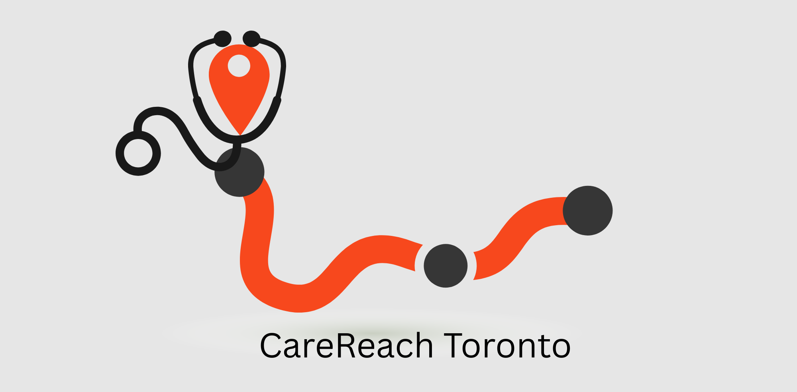
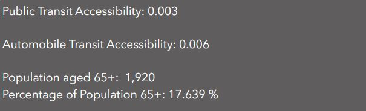

# EquiTransit Champions
Team Members:

-Chrishma Perera

-Christopher Johnson

# App
## [CareReach Toronto Application](https://experience.arcgis.com/experience/108d33ab19b7443997b0f486d101cf3d)

# Mission Statement

Having a healthy life is a fundamental aspiration for every person, and equitable physical access to healthcare is central to achieving it. With the adoption of the United Nations Sustainable Development Goals in 2015, Canada is working to ensure its people have well-maintained physical access to healthcare whenever and wherever it's needed. Of these interconnected SDGs, SDGs 3 (Good Health and Well-being), SDG 9 (Industry, Innovation and Infrastructure), and SDG 11 (Sustainable Cities and Communities) collectively contribute to physical access to healthcare in cities¹. Despite promising efforts to improve healthcare access in Canadian cities, significant barriers remain². Particularly for adults aged 65 and older. The structure and performance of both public and private transportation networks directly shape older adults' ability to access hospitals and healthcare facilities safely and efficiently.

In Toronto, the aging population is growing rapidly. According to the 2021 Census, approximately 477,000 residents are aged 65 and older. By 2041, this number is projected to exceed 719,000 — an increase of more than 50 percent, with the sharpest growth among those aged 75 and older³. Many older adults live with chronic conditions such as hypertension, diabetes, and chronic obstructive pulmonary disease, increasing their need for timely access to hospital services⁴. The app **CareReach Toronto** was developed to respond to this urgent demographic and infrastructural shift. The platform enables users to visualize the nearest available hospital bed and accessibility via sustainable transportation options, such as public transit and automobile travel. By integrating health infrastructure data with transportation accessibility metrics, CareReach Toronto empowers older adults to make informed decisions about access to healthcare during emergencies and for routine care.

Beyond individual users, CareReach Toronto generates actionable insights for urban and transportation planners. The platform provides neighbourhood-level accessibility scores, hospital bed-to-population ratios, and identifies 15-minute transit deserts across the city. It also reveals how access to sustainable transportation intersects with the age structure of census tracts, highlighting areas where vulnerable populations face disproportionate barriers. By interconnecting aging populations with sustainable transportation planning, CareReach Toronto advances equity-centered urban transport design and supports data-driven strategies that prioritize older and vulnerable communities, ensuring sustainable transport for everyone!

---

## Statement of Characteristics  

This application is designed to evaluate and communicate healthcare accessibility through a sustainable transportation lens, with a particular focus on equity and demographic vulnerability within Toronto. The platform enables users to visualize their nearest hospital bed using public transit and directly compare this with automobile-based accessibility. By integrating travel-time analysis with hospital bed capacity data, the application allows users to identify their closest accessible hospital by transit, assess accessibility scores at the neighbourhood and census tract levels, and examine bed-to-population ratios associated with the nearest hospital. In doing so, the tool supports both individual understanding and system-level evaluation of healthcare access.  

For planners and decision-makers, the application functions as a spatial diagnostic instrument by identifying 15-minute public transit “deserts,” or areas where residents cannot reasonably reach a hospital bed within a defined travel threshold. This provides a clear evidence base for sustainable transportation planning and healthcare infrastructure assessment. A defining characteristic of the platform is its integration of demographic equity analysis, particularly the relationship between sustainable transport accessibility and the age structure of census tracts. Given that senior citizens are less likely to be able to rely on private vehicles, public transit accessibility becomes a critical determinant of healthcare access. By revealing disparities between older and younger tracts, the application facilitates equity-based transport and healthcare planning, enabling more vulnerable populations to be prioritized in policy development and infrastructure investment decisions.

## Methodology 

### 2SFCA  

Healthcare accessibility is assessed using the Two-Step Floating Catchment Area (2SFCA) method.⁶ Publicly available Toronto hospital bed counts were used as the measure of healthcare supply, while census tract population counts were used to represent demand. Accessibility is therefore operationalized as a bed-to-population ratio at the census tract level within defined travel-time thresholds.

The 2SFCA method evaluates the balance between healthcare supply and population demand within floating travel-time catchments. In the first step, a catchment area is created around each healthcare provider (e.g., hospital) using a specified travel-time threshold of 15 minutes, calculated separately for automobile and public transit. The total population within each provider’s catchment is summed, and a provider-to-population ratio is computed by dividing the number of hospital beds by the total population within that catchment. This ratio represents the level of service availability at each provider location.

In the second step, a catchment area is created around each population location, represented by census tract centroids, using the same 15-minute travel threshold. All providers falling within this population-based catchment are identified, and their previously calculated provider-to-population ratios are summed. The resulting value represents the 2SFCA accessibility score for each census tract. Higher scores indicate greater relative accessibility to hospital beds, while lower scores reflect more limited access relative to demand.

### Assessing Automobile vs. Public Transit  

Automobile 15-minute catchments from census tract centroids and hospital locations were created via network analysis in ArcGIS Pro using the **Generate Travel Areas** tool. For automobile travel, the ArcGIS Online cloud-based network dataset was used to estimate travel times.

To assess public transport accessibility, General Transit Feed Specification (GTFS) data for the City of Toronto were used. The transit dataset includes Toronto Transit Commission (TTC) subway, bus, and streetcar routes and schedules. This network was built and implemented within ArcGIS Pro to generate 15-minute public transit catchments.

### Equity Assessment  

An age-based accessibility ratio was calculated to evaluate equity in healthcare access. The ratio is measured as the average accessibility of older census tracts divided by the average accessibility of younger census tracts.⁷˒⁸ Older tracts are defined as those with a proportion of residents aged 65 and over exceeding the City of Toronto average of 17.1%. A ratio above one indicates that older tracts experience worse accessibility to hospital beds relative to younger tracts.

---

## Limitations  

### Geographic Effects  

Edge effects are present in census tracts located near the municipal boundary of Toronto. The study area is restricted to this boundary, and hospitals located outside the city are excluded from the analysis. In practice, residents in these edge tracts may access hospitals in adjacent municipalities. As a result, accessibility in peripheral tracts is likely underestimated.

### Public Transit Data  

Census tract centroids, representing demand locations, were snapped to their nearest public transit stop. This approach does not account for walking time between the centroid and the transit stop. Therefore, the 15-minute catchment reflects travel time spent on public transit vehicles only, including service frequency and transfers, but excludes first-mile and last-mile walking time.

---
# Application Features

## Neighbourhood Healthcare Accessibility Index Search

### 1. Healthcare Accessibility Variation
This view examines variation in healthcare accessibility across Toronto's census tracts.
- The legend (top left) represents **hospital beds per person** in each tract.

- The histogram shows that **362 census tracts cannot reach a hospital bed within 15 minutes**, regardless of travel mode.

- This highlights significant spatial gaps in healthcare accessibility.

---

### 2. Neighbourhood-Based Filtering
Users can:
- Select any Toronto neighbourhood from the drop-down menu (bottom left)
- Click **Load** to filter census tracts within that neighbourhood
- View associated **public transit travel catchments**

This allows users to:
- Identify the most convenient hospital via public transit
- Click on hospitals to view:
  - Total staffed beds
  - Bed breakdown by department

---

### 3. Accessibility Score Summary
When a neighbourhood is selected, the dashboard simultaneously displays:
- Public transit accessibility score
- Automobile accessibility score
- Total population of the selected area

-This enables quick comparison of transportation modes and healthcare access.

---

# Travel Catchments and Equity Analysis

## 1. Equity Assessment View
Users are first directed to the **Equity Assessment** view.

Key findings:
- Younger census tracts experience **33% higher healthcare accessibility** compared to older tracts.

When a neighbourhood is selected:
- Population aged 65+ is calculated
- Proportion of older adults relative to total population is displayed

This allows users to compare healthcare accessibility:
- Across neighbourhoods
- Within neighbourhoods
- In relation to older populations

---

## 2. Residential Travel Catchments
In the **Residences** section, users can:
- View public transit catchments
- View automobile catchments
- Compare reachable hospitals between:
  - Sustainable transportation (public transit)
  - Non-sustainable transportation (automobile)

---

## 3. Hospital-Based Catchments
In the **Hospitals** section, users can:
- Compare hospital service areas by travel mode
- Examine hospital bed-to-population ratios
- Assess differences between sustainable and non-sustainable catchments

This enables evaluation of transportation equity in healthcare access.

---

# Data Sources  

| Category | Dataset | Source | Link |
|-----------|----------|---------|------|
| **Geographic Boundary Data** | Toronto Municipal Boundary | City of Toronto Open Data | https://open.toronto.ca/dataset/regional-municipal-boundary/ |
|  | Toronto Neighbourhood Boundaries | ArcGIS Hub | https://hub.arcgis.com/datasets/uji::toronto-neighbourhoods/explore |
|  | Census Tract Boundaries (2021) | Statistics Canada | https://www12.statcan.gc.ca/census-recensement/2021/geo/sip-pis/boundary-limites/index2021-eng.cfm?year=21 |
| **Population Data (Demand)** | Population by Census Tract | Statistics Canada | https://www150.statcan.gc.ca/t1/tbl1/en/tv.action?pid=9810001401&geocode=S0503535 |
| **Hospital Bed Data (Supply)** | Hospital Beds Staffed | Canadian Institute for Health Information (CIHI) | https://www.cihi.ca/en/access-data-and-reports/data-tables?keyword=Hospital+Beds+Staffed&published_date=All&acronyms_databases=All&type_of_care=All&place_of_care=All&population_group=All&health_care_quality=All&health_conditions_outcomes=All&health_system_overview=All&sort_by=field_published_date_value&items_per_page=10 |
| **Transit Data** | Toronto GTFS Data | Canadian Public Transit Network Database | https://www150.statcan.gc.ca/n1/pub/23-26-0003/232600032025001-eng.htm |

# References

¹ Cling, J.-P., & Delecourt, C. (2022). Interlinkages between the Sustainable Development Goals. *World Development Perspectives*, 25, 100398. https://doi.org/10.1016/j.wdp.2022.100398

² Patrick, K., & Laupacis, A. (2023). A focus on access to health care in Canada. *CMAJ: Canadian Medical Association Journal*, 195(3), E123–E124. https://doi.org/10.1503/cmaj.230040

³ Owusu, B., Bivins, B., Marseille, B. R., & Baptiste, D. (2023). Aging in place: Programs, challenges, and opportunities for promoting healthy aging for older adults. *Nursing Open*, 10(9), 5784–5786. https://doi.org/10.1002/nop2.1872

⁴ Statistics Canada. (2021). *Census of Population*.

⁵ Ontario Ministry of Health, IntelliHealth Ontario. (2024). *Healthy Aging in Toronto, at a glance*.

⁶ Weiping Luo and Fahui Wang, “Measures of Spatial Accessibility to Health Care in a GIS Environment: Synthesis and a Case Study in the Chicago Region,” *Environment and Planning B: Planning and Design* 30, no. 6 (2003): 865–884, https://doi.org/10.1068/b29120.

⁷ Rafael H. M. Pereira, Carlos Kauê Vieira Braga, Luciana Mendes Servo, Bernardo Serra, Pedro Amaral, Nelson Gouveia, and Antonio Paez, “Geographic Access to COVID-19 Healthcare in Brazil Using a Balanced Float Catchment Area Approach,” *Social Science & Medicine* 273 (2021): 113773, https://doi.org/10.1016/j.socscimed.2021.113773.  

⁸ Henry Shaver, Junghwan Kim, Ehab Diab, and Jinhyung Lee, “Bridging the Gap: A Social Equity Analysis of Intra-City Transit Access to Inter-City Rail in Canada,” *Cities* 163 (August 2025): 106041, https://doi.org/10.1016/j.cities.2025.106041.
Source: Statistics Canada
https://www150.statcan.gc.ca/n1/pub/23-26-0003/232600032025001-eng.htm

